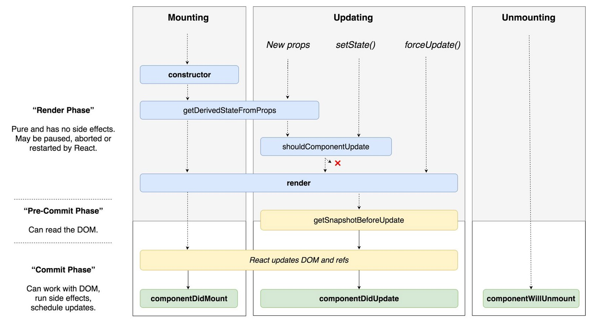

# 리액트에 있는 라이프사이클과 각 라이프사이클의 역할을 설명하세요.
리액트의 라이프사이클은 크게 4가지로 설명할 수 있습니다. 최초로 컴포넌트 객체가 생성될 때 한 번 수행되어지는 componentDidMount()와  
초기에 화면을 그려줄 때와, 업데이트가 될 때 호출되는 render()가 있습니다.  
그리고 컴포넌트의 속성 값 또는 상태값이 변경되면 호출되어지는 componentDidUpdat와  
마지막으로 컴포넌트가 소멸될 때 호출되어지는 componentWillUnmount()가 라이프사이클의 역할입니다.

 

